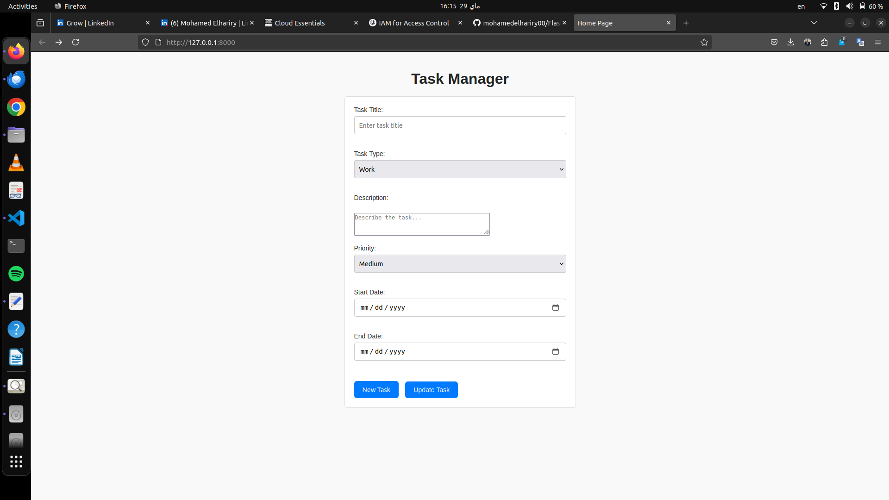
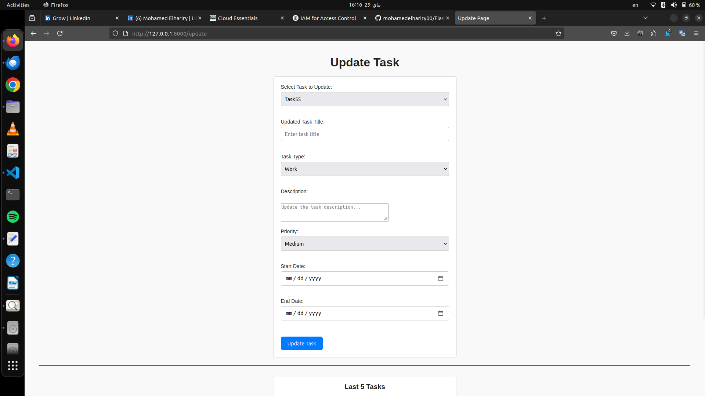
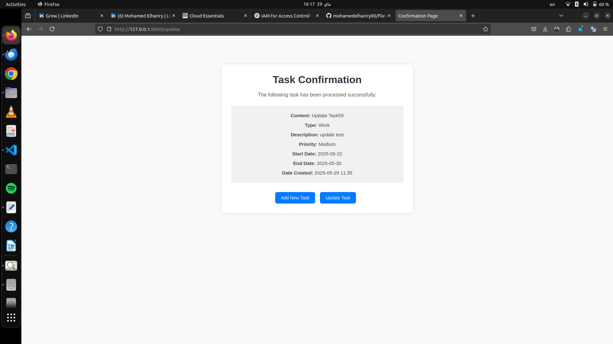

#  Flask Web Application

A simple and lightweight web application built using **Flask** that allows users to manage tasks effectively. It supports adding, updating, and viewing tasks with detailed fields like description, priority, and due dates.

---

##  Features

- Add a new task with:
  - Task content
  - Task type (Work, Study, Personal, etc.)
  - Description
  - Priority (High, Medium, Low)
  - Start and end date
- Update existing tasks
- View confirmation after adding or updating a task
- Stores all tasks in a **SQLite database**
- Minimal, clean UI styled with custom **CSS**

---

##  Technologies Used

- Python 3
- Flask
- Flask-SQLAlchemy
- HTML / Jinja2 Templating
- CSS

---

##  Project Structure

```
project/
│
├── app.py                    # Main Flask app
├── templates/
│   ├── base.html             # Common base template
│   ├── homepage.html         # Main form to add task
│   ├── update.html           # Form to update a task
│   ├── confirm.html          # Confirmation page for actions
│   └── update_result.html    # Shows update success/failure
│
├── static/
│   └── style.css             # All styles in one file
│
├── instance/
│   └── test.db               # SQLite database file
│
├── README.md                 # Project documentation
└── requirements.txt          # Python dependencies (if used)
```

---

##  How to Run the Project Locally

### 1. Clone the repository

```bash
git clone https://github.com/mohamedelhariry00/FlaskRepo.git
cd your-repo-name
```
### 2. (Optional) Create a virtual environment

```bash
python -m venv venv
source venv/bin/activate  # On Windows use: venv\Scripts\activate
```

### 3. Install dependencies

```bash
pip install -r requirements.txt
```

> If you don't have `requirements.txt`, just install Flask manually:
```bash
pip install Flask Flask-SQLAlchemy
```

##  Run the Application

To start the Flask server, run the following command in your terminal:

```bash
python app.py
```

Once the server is running, open your browser and go to:

📍 **http://127.0.0.1:8000**

> **Note:**  
> The application is configured to run on **port 8000**.  
> If the port is already in use, you can either stop the program using it or change the port number in the `app.py` file like this:


##  Routes Summary

| Route            | Method   | Description                        |
|------------------|----------|------------------------------------|
| `/`              | GET      | Show homepage with task form       |
| `/add`           | POST     | Add a new task                     |
| `/update`        | GET/POST | Update an existing task            |
| `/update_result` | GET      | View result of update (if used)    |

---

##  Screens and Workflow

1. **Homepage** → Add new task
2. **Confirmation Page** → Task details shown after add/update
3. **Update Page** → Select existing task, edit, and confirm
4. **Update Result Page** → Show update success or failure

---

##  Notes

- All task data is stored in `instance/test.db`.
- The app auto-creates the database if it doesn't exist.
- Make sure you use **valid date formats** (e.g. `YYYY-MM-DD`) when entering dates.
- Ensure you're passing `datetime.date` objects when updating the database to avoid SQLAlchemy errors.

---

##  Screenshots

### Homepage


### Updatepage


### TaskConfirmation


### Updateconfirmation

---

## Connect with Me

[](https://www.linkedin.com/in/mohamed-elhariry-/)

